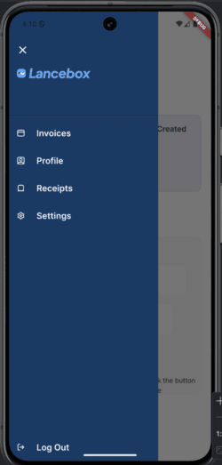
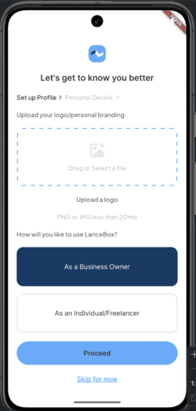
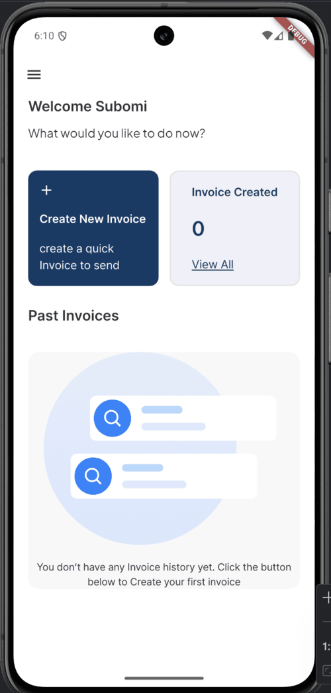
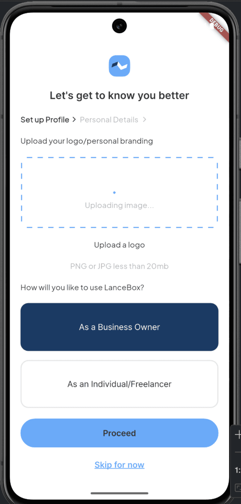
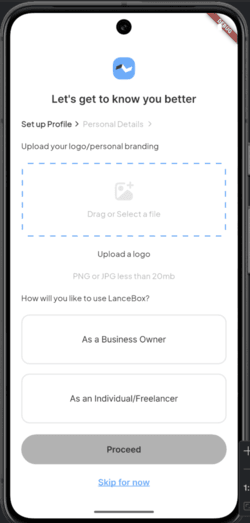
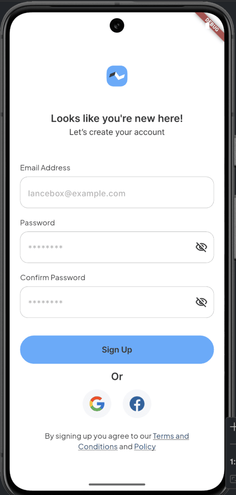
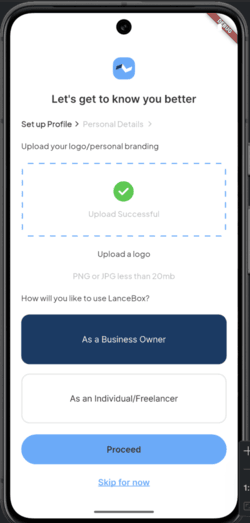

# LanceBox

LanceBox is a simple mobile invoicing app built with Flutter for PrimeTrust Bank customers. It provides onboarding, profile setup, and invoice creation features, suitable as a demonstration of a commercial banking digital solution.

## Features

- **Sign-Up Screen:** New customers can register using their email and password.
- **Onboarding Screen:** Captures basic details (logo upload + account type selection) during account creation.
- **Customer Dashboard:** Provides navigation across Invoices, Profile, Receipts, and Settings.
- **Invoice Creation:** Multi-step flow — invoice details, bank details, and PDF preview.
- **Form Validation:** Email/password validation with match checking and inline error messages.

### Screenshots









## Technologies Used

- **Flutter:** For building the cross-platform mobile application.
- **Dart:** Programming language used in Flutter development.
- **Riverpod:** Used for state management in this project.
- **Architecture:** Built using MVVM architecture (state notifiers as ViewModels, widgets as Views).

## Installation

### Prerequisites

- [Flutter SDK](https://docs.flutter.dev/get-started/install)
- [Dart SDK](https://dart.dev/get-dart)
- An IDE (e.g., Visual Studio Code, Android Studio)

### Clone the Repository

```bash
git clone https://github.com/Jayhymn/lancebox.git
```

### Configuration

1. Change your working directory to the cloned repository:

```bash
cd lancebox
```

2. Ensure you have the necessary Flutter packages installed:

```bash
flutter pub get
```

### Build and Run

1. Connect your physical device or start an emulator.
2. To build and run the project:

```bash
flutter run
```

## Project Structure

```
lib/
├── main.dart             # App entry point + route table
├── states/               # Riverpod StateNotifier ViewModels
├── presentation/
│   ├── views/            # Screens (auth, setup, dashboard, invoice flow)
│   └── widgets/          # Reusable UI widgets
├── shared/               # Theme, constants, routes
└── utils/                # Helpers (image picker/upload)
```

## Usage

1. Upon launching the app, create a new account using the sign-up form.
2. New users are taken through the onboarding process to fill in their profile details.
3. The dashboard provides access to invoice creation, profile, receipts, and settings.

## Contributing

Contributions are welcome! Please feel free to submit a pull request or create an issue for feedback and suggestions.

## License

This project is licensed under the Apache License 2.0. See the [LICENSE](LICENSE) file for details.

Thank you for choosing LanceBox! If you encounter any issues or have suggestions for improvements, please don't hesitate to [create an issue](https://github.com/Jayhymn/lancebox/issues).